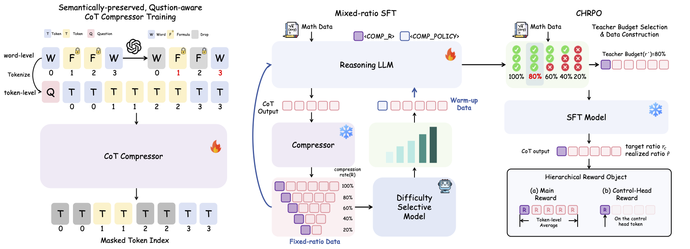
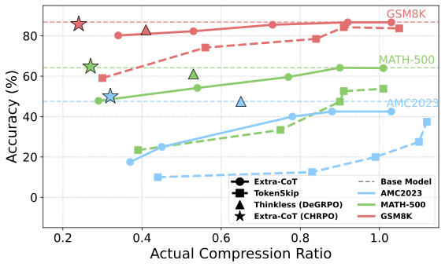

# Extra-CoT: Extreme-Ratio Chain-of-Thought Compression

**Towards Efficient Large Language Reasoning Models via Extreme-Ratio Chain-of-Thought Compression**
Yuntian Tang, Bohan Jia, Wenxuan Huang, Lianyue Zhang, Jiao Xie, Wenxi Li, Wei Li, Jie Hu, Xinghao Chen, Rongrong Ji, Shaohui Lin<br>
[arXiv:2602.08324](https://arxiv.org/abs/2602.08324)

---

## TL;DR

**Extra-CoT** is a **three-stage** framework that compresses Chain-of-Thought (CoT) to **extreme budgets** (e.g., 20% tokens) while preserving reasoning fidelity and delivering **real wall-clock speedups**.

- **Stage 1 (Compressor):** a *formula-aware*, question-aligned CoT compressor that produces **high-fidelity** compressed rationales for supervision.
- **Stage 2 (Mixed-ratio SFT):** trains a single model to follow **multiple compression ratios** with stable controllability (no “control collapse” at low ratios).
- **Stage 3 (CHRPO):** a hierarchical RL algorithm that learns an adaptive policy (**`<COMP_POLICY>` / `<POLICY>` mode**) for ultra-low budgets.



> This repo contains code for **SFT + vLLM evaluation** and the **ratio-controlled inference interface**.

This line chart highlights the key trade-off: **accuracy vs. compression** under different budgets. Lower ratios indicate stronger compression (fewer reasoning tokens).
<p align="center">
  
</p>

---

## What’s in this repo?

- ✅ Ratio-controlled inference with special tokens (`<COMP_20>`, `<COMP_40>`, …, `<COMP_POLICY>`)
- ✅ vLLM-based evaluation script to sweep ratios and dump per-ratio predictions + metrics
- ✅ LLaMA-Factory-based SFT config/entry

---

## Method Overview

Extra-CoT targets a practical failure mode of “short-CoT training”: at extreme ratios, many approaches break symbolic consistency and controllability collapses (targets 0.6/0.8 produce similar realized lengths).

Extra-CoT addresses this via:

1. **High-fidelity supervision:** preserve equations, critical symbols, and task-specific anchors while removing redundancy.
2. **Mixed-ratio instruction-following:** a single model can follow *multiple* budgets reliably.
3. **Adaptive policy learning:** in `<COMP_POLICY>` mode, the model learns when to spend tokens.

---

## Experiments

### Benchmarks
We evaluate across common reasoning datasets (e.g., **GSM8K**, **MATH-500**, **MetaMath-1k**, **AMC2023**) and multiple compression budgets:
- Fixed ratios: **γ ∈ {0.2, 0.4, 0.6, 0.8, 1.0}**
- Adaptive: **`<COMP_POLICY>`**

### Metrics
- **Tokens ↓**: number of generated tokens (counted in *think-only accounting* when applicable)
- **ActRatio**: realized compression ratio aggregated over the dataset
- **Acc@all ↑**: accuracy over the full test set
- **Latency ↓**: end-to-end seconds per instance under the same decoding stack

---

## Key Results

### Main results (Qwen3-1.7B)

The table reports the accuracy–compression trade-off on GSM8K, MATH-500, and AMC2023.  Each cell shows `Tokens / Acc (ActRatio)`, where lower ActRatio means stronger compression.

| Method | Target | GSM8K (Tok / Acc (Act)) | MATH-500 (Tok / Acc (Act)) | AMC2023 (Tok / Acc (Act)) |
|---|---:|---:|---:|---:|
| Base Model | – | 873 / 86.8 (–) | 1675 / 64.2 (–) | 2092 / 47.5 (–) |
| TokenSkip | 0.8 | 794 / 84.3 (0.91) | 1527 / 53.0 (0.91) | 2302 / 27.5 (1.10) |
| Extra-CoT (Ours) | 0.8 | 807 / 86.7 (0.92) | 1520 / 64.2 (0.90) | 1845 / 42.5 (0.88) |
| TokenSkip  | 0.4 | 516 / 74.2 (0.56) | 1259 / 34.4 (0.75) | 1743 / 12.5 (0.83) |
| Extra-CoT (Ours) | 0.4 | 469 / 82.3 (0.53) | 920 / 54.2 (0.54) | 945 / 25.0 (0.45) |
| TokenSkip  | 0.2 | 273 / 59.1 (0.30) | 660 / 23.4 (0.39) | 911 / 10.0 (0.44) |
| **Extra-CoT (Ours)** | **0.2** | **303 / 80.2 (0.34)** | **481 / 47.8 (0.29)** | **782 / 17.5 (0.37)** |
| Thinkless (DeGRPO) | – | 356 / 85.5 (0.41) | 888 / 63.6 (0.53) | 1369 / 50.0 (0.65) |
| **Extra-CoT (CHRPO)** | **`<POLICY>`** | **210 / 85.8 (0.24)** | **452 / 64.8 (0.27)** | **675 / 50.0 (0.32)** |

---

### Latency (end-to-end)

The following table reports **end-to-end per-instance inference latency** (seconds) under the same decoding stack.
TokenSkip is evaluated at its smallest compression ratio (**0.2**) for a direct speed comparison in the extreme-compression regime.

| Dataset | Base Model (s) | TokenSkip (s) | Extra-CoT (s) |
|---|---:|---:|---:|
| GSM8K | 0.7298 | 0.6829 | **0.2254** |
| MATH-500 | 1.8176 | 1.9409 | **0.7721** |
| MetaMath-1k | 0.7186 | 0.6769 | **0.2799** |

---

## OpenPangu

The following table summarizes the **long-context ablation** on **Pangu-Embedded-7B-V1.1**, reporting the token–accuracy trade-off across fixed ratios and the `<POLICY>` mode.
We report **average generated tokens** (Tokens ↓) and **accuracy** (Acc@all ↑) on **GSM8K** and **MATH-500**.


| Method | Ratio | GSM8K Tokens ↓ | GSM8K Acc@all ↑ | MATH-500 Tokens ↓ | MATH-500 Acc@all ↑ |
|---|---:|---:|---:|---:|---:|
| Extra-CoT (Ours) | 0.2 | 1021 | 80.7 | 2822 | 66.0 |
| Extra-CoT (Ours) | 0.4 | 1720 | 83.7 | 3755 | 74.6 |
| Extra-CoT (Ours) | 0.6 | 2040 | 82.6 | 4259 | 77.4 |
| Extra-CoT (Ours) | 0.8 | 2192 | 84.5 | 4748 | 79.4 |
| Extra-CoT (Ours) | `<POLICY>` | 2070 | 84.2 | 3827 | 74.0 |
| Base Model (Fast) |          – |           1554 |            75.7 |              4954 |               72.2 |

---

# Reproducing

## SFT
We use LLaMA-Factory to train the SFT model.

```bash
cd LLaMA-Factory
FORCE_TORCHRUN=1 NNODES=1 NODE_RANK=0 MASTER_ADDR=0.0.0.0 MASTER_PORT=12345 \
llamafactory-cli train examples/train_full/qwen3-1.7b_full_sft.yaml
```

## Inference & Evaluation

We provide `eval_all_ratios_vllm.py` to run **multiple compression ratios** with vLLM and save outputs:

* `<output_dir>/<ratio>/prediction.json`
* `<output_dir>/<ratio>/metrics.json`

### 1) Start a vLLM server

```bash
vllm serve your_model_path --served-model-name local_core_model \
  --host 0.0.0.0 --port 8000 --max-model-len 20000
```

### 2) Run evaluation

```bash
python eval_all_ratios_vllm.py --host 127.0.0.1 --port 8000 \
  --model local_core_model \
  --output_dir outputs/qwen3-1.7b
```

### Special tokens / ratio control

`eval_all_ratios_vllm.py` constructs:

* `user_text = "Please reason step by step, and put your final answer within \\boxed{}.\n" + query`
* Then appends a control token such as:

  * `<COMP_XX>` (fixed ratio)
  * `<COMP_POLICY>` (learned policy mode; corresponds to `<POLICY>` in the paper tables)

---

## Acknowledgements & Related Projects

This repo is built with the following open-source toolchains:
- **[LLaMA-Factory](https://github.com/hiyouga/LlamaFactory)** — a unified and efficient fine-tuning toolkit for LLMs, used here for SFT training. 
- **[vLLM](https://github.com/vllm-project/vllm)** — a high-throughput, memory-efficient LLM inference & serving engine, used here for serving and ratio-sweeping evaluation.

We also acknowledge the following related works on compression:
- **[TokenSkip](https://github.com/hemingkx/TokenSkip)** — controllable Chain-of-Thought compression by pruning less important tokens and training models to skip redundant tokens during reasoning.
- **[LLMLingua](https://github.com/microsoft/LLMLingua)** — prompt compression that removes non-essential tokens using a compact model, accelerating inference with minimal performance loss.
---

## Citation

If you find this work useful, please cite:

```bibtex
@misc{tang2026efficientlargelanguagereasoning,
      title={Towards Efficient Large Language Reasoning Models via Extreme-Ratio Chain-of-Thought Compression}, 
      author={Yuntian Tang and Bohan Jia and Wenxuan Huang and Lianyue Zhang and Jiao Xie and Wenxi Li and Wei Li and Jie Hu and Xinghao Chen and Rongrong Ji and Shaohui Lin},
      year={2026},
      eprint={2602.08324},
      archivePrefix={arXiv},
      primaryClass={cs.LG},
      url={https://arxiv.org/abs/2602.08324}, 
}
```
